

---

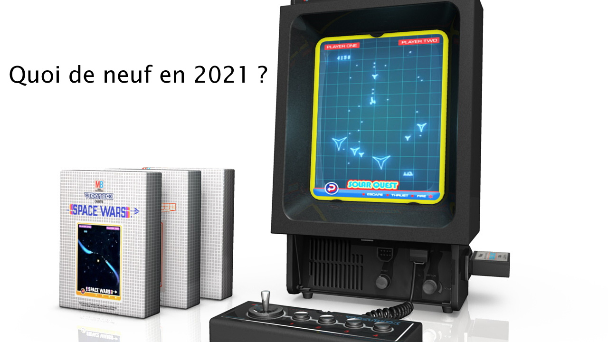

---

# Un peu d'histoire
- La première version de la console a été réalisée par 4 ingénieurs, dont John Ross, de chez Western Technologies. Ils ont utilisé des composants militaires du surplus de l'US Navy !
- Le système a été vendu sous licence à G.C.E. en 1981. 
- Il s'en est suivi un an de développement pour présenter la console en juin 1982 au CES.
- Disponibilité en volume à noël 1982 aux US, et gros carton !

---

# Un peu de Technique

- Un Motorola 68A09 @ 1.5Mhz
$ 37 pièce à l'époque. Un 6502 coutait $ 6.

- RAM: 1 Ko (C'est l'opulence :smiley:)
- ROM: 8 Ko
- Cartouche de 32ko
- Tube de 11 pouces (par 9)
- MOS 6522 VIA
- AY-3-8912 (MSX, Oric, Amstrad, ZX, etc.)

---

# Mods Hardware sur la console

- Anti-buzz
- Sortie ligne audio jack 3,5mm

---

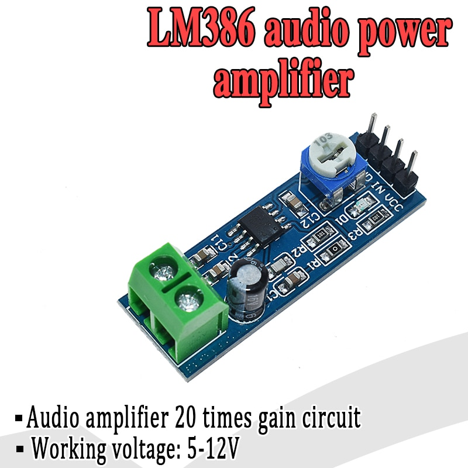

# Anti-buzz

Au choix:
* un investissement de $60 sur eBay + $40 FDP + 30 € de taxe
* Achat direct chez Aliexpress pour 0,40 € !

Vous avez 4h :smile:

(Ceci dit pour faire la manip, on a mis 4h !)

---

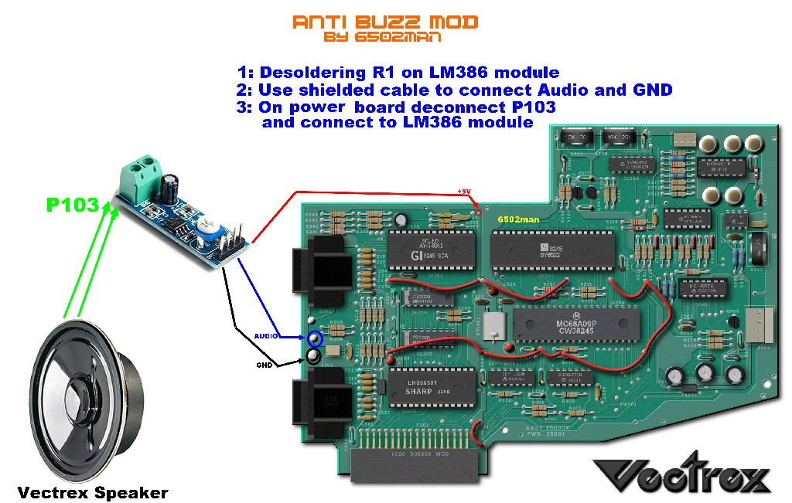

[Montage](https://www.6502man.com/Bricolages/Vectrex_AntiBuzz/Vectrex_Repair_&_AntiBuzz_Mod.html)

---

# Sortie Audio

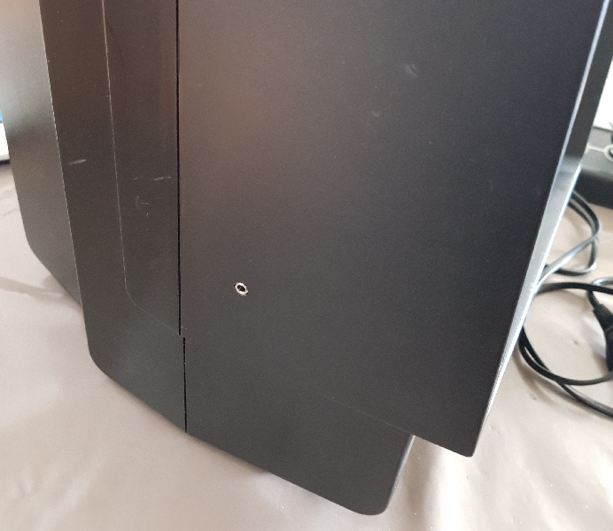

---

# DIY Hardware

- Light Pen:
Il est introuvable, donc on n'a pas le choix, il faut en fabriquer un soi-même.

- Un gamepad:
 Il faut bien l'avouer; la manette d'origine est difficile à conserver en bon état.
Et on a tout intérêt à en réaliser une nouvelle.

---

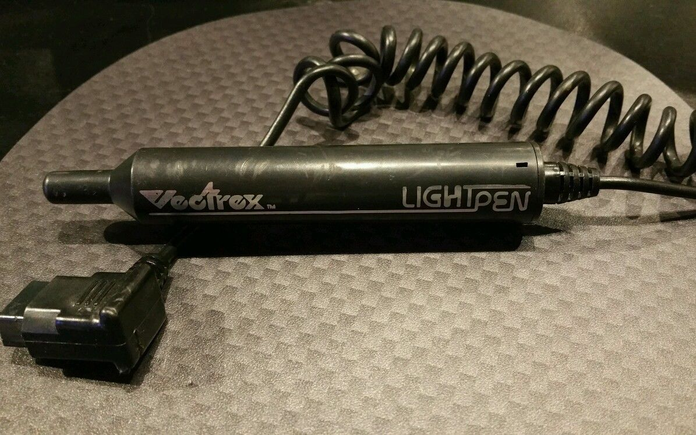

# Light Pen

Un original

---

# Light Pen

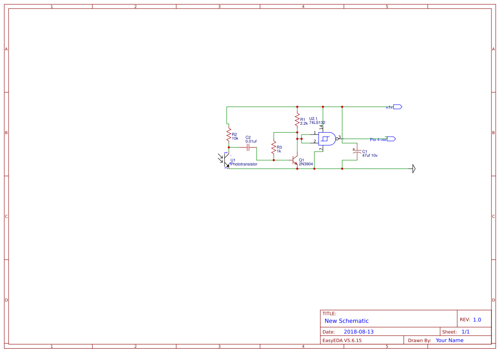

- Le montage est facile
- Quelques euros de composants
- Un câble DB9 de chez Aliexpress
- 15 min de montage
- Le plus difficile c'est de trouver un marqueur pas trop moche :smile:

---

# L'ancêtre  des Wacom :smirk:

---

# Light Pen à 4 boutons

- Un projet pour 2021

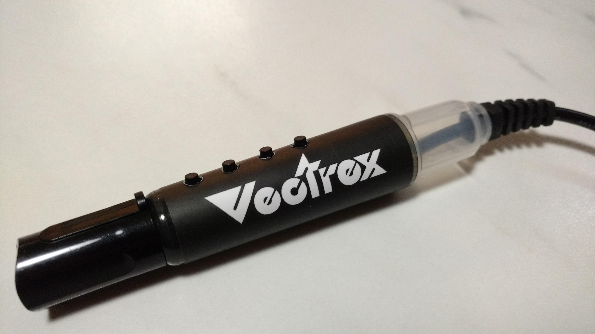

---

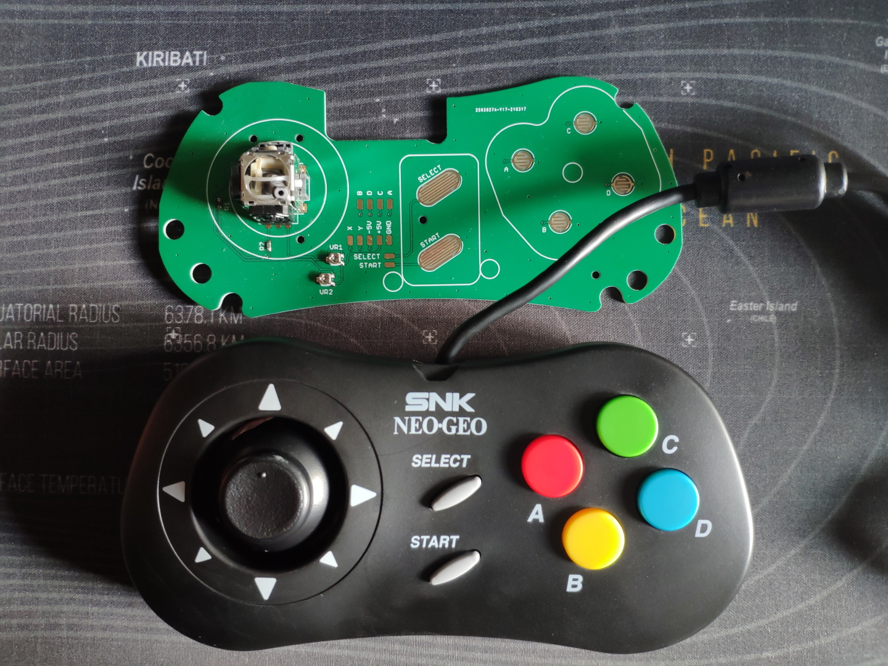

# Gamepad

---

# Gamepad

- Basé sur un PCB développé par un Allemand.
- Il s'insère **parfaitement** dans la manette Neo-Geo Mini.
- Difficulté de montage moyenne (45 min-1 h)
- Avec cette manette, à vous les joies des niveaux qui étaient impossible à passer :v:

---

# PiTrex

La PiTrex est une carte très récente (2021).

Elle propose avec l'aide d'un Raspberry Pi Zero de prendre le contrôle complet de la console et d'émuler avec une version de MAME qui tourne sur le Pi Zero des jeux d'arcades vectoriels qui étaient sortis dans les salles d'arcade durant les années 70 et début 80.

On parle d'environ 120 jeux de salles d'Arcade qui ne sont jamais arrivés en Europe !

---

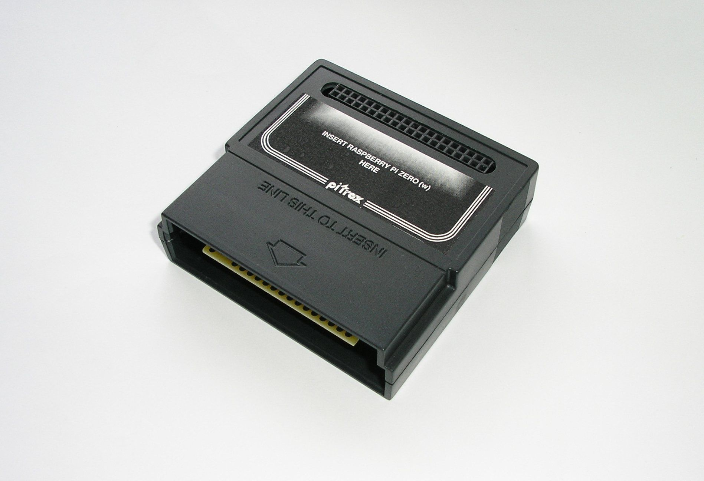

# PiTrex

---

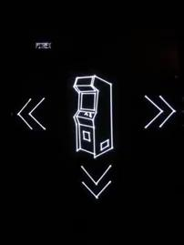

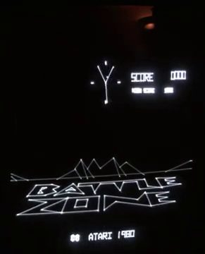

---

# PiTrex

# Mais komment Kon Kode ?

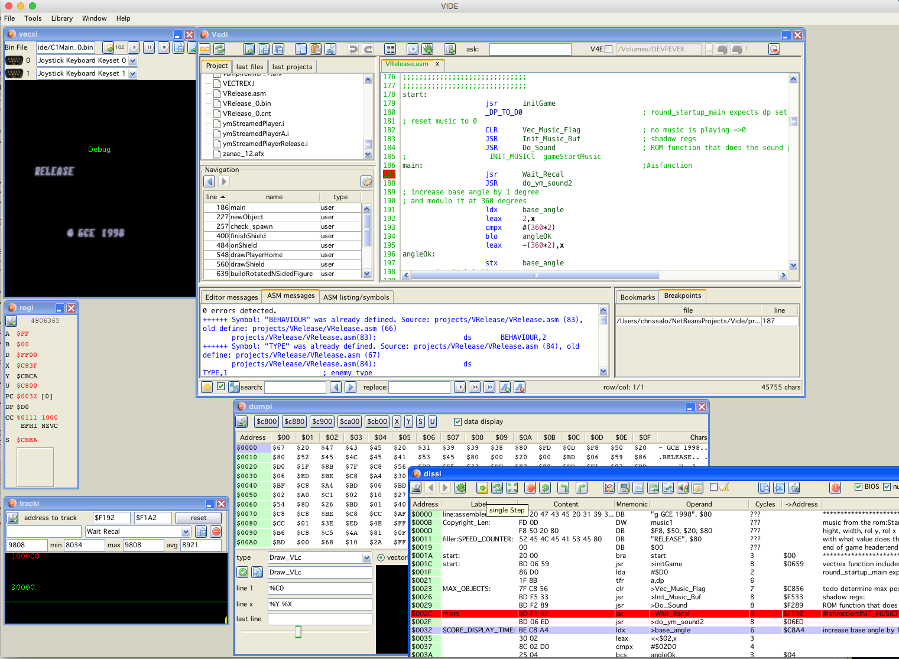

- Un environnement tout intégré a été développé par Malban
- VIDE : Vectrex Integrated Developement Environment
- http://malban.de/vide

---

# Autre système Vectoriel
# Le Laser !

Cela fait déjà plusieurs dizaines d'années que l'on affiche des motifs et que l'on anime des dessins à l'aide de faiceau laser.

- Jean-Michel Jarre Houston 1986
- ZZ Top Tournée 1986

A l'époque, il est vrai que ce n'était que des cônes et des ellipses :smiley:

---

# Projet Hackaday.io 2017
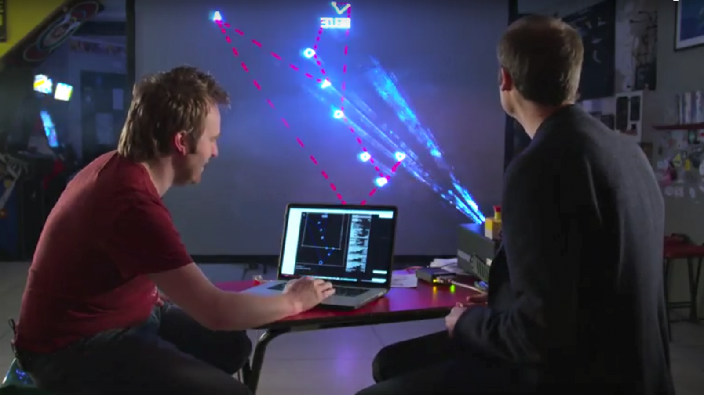

---

# Pro

- Une belle idée pour une manifestation publique.
Au hasard un festival Retro :wink:

# Con

- Le prix !
Il faut compter sur un budget de 1 500 € à 2 500 € suivant la puissance du laser :open_mouth:

---

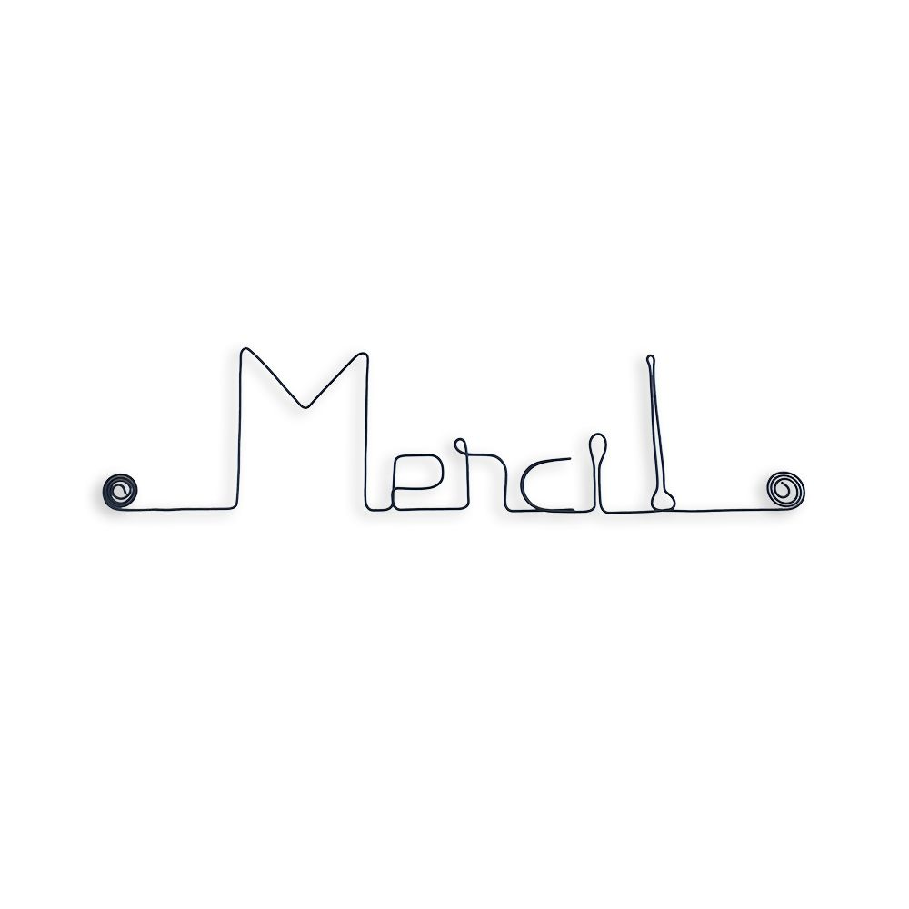